# 作业

## 实验环境搭建

### 配置BusyBox

生成_install目录
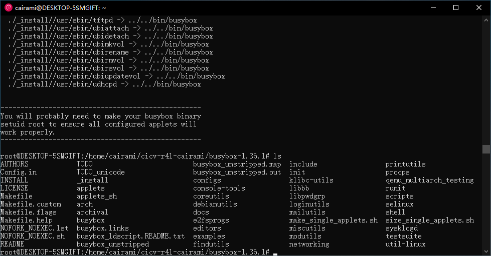

### 配置Linux文件夹

检查内核rust支持已经启用

## 作业1：编译Linux内核

### 进入Linux文件夹，使用如下命令进行编译：

#### make x86_64_defconfig

#### make LLVM=1 menuconfig

#set the following config to yes

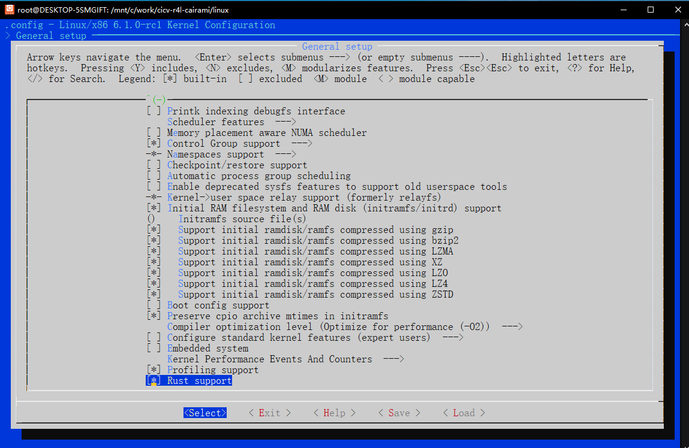

#### make LLVM=1 -j$(nproc)

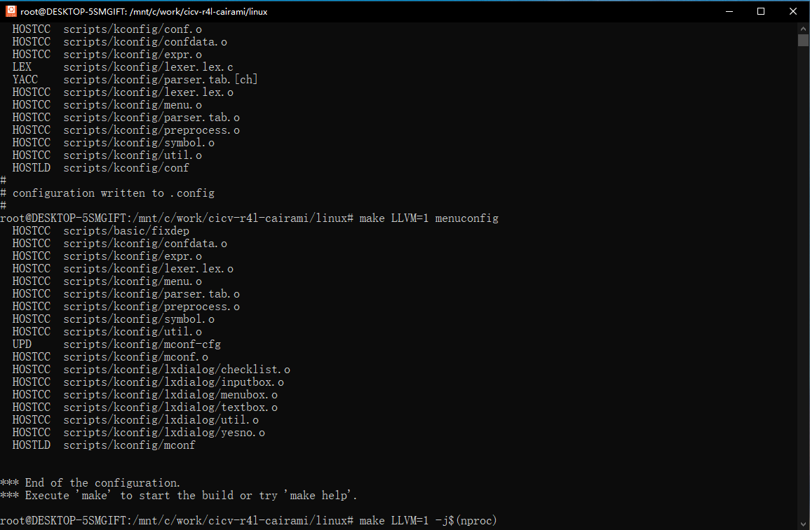

## 作业2：对Linux内核进行配置

### 编译src_e1000的代码成一个内核模块

### 禁用默认的C版本e1000网卡驱动

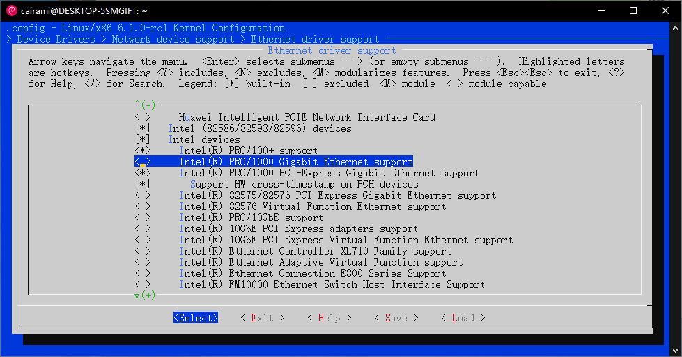

### 重新编译内核，运行./build_image.sh，启动Qemu

### 手动配置网卡驱动

insmod r4l_e1000_demo.ko
ip link set eth0 up
ip addr add broadcast 10.0.2.255 dev eth0
ip addr add 10.0.2.15/255.255.255.0 dev eth0
ip route add default via 10.0.2.1
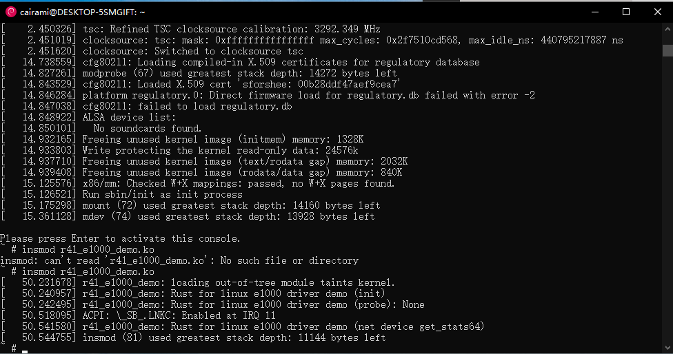

ping 10.0.2.2
![1699343830935][def]

### 问题1：编译成内核模块，是在哪个文件中以哪条语句定义的？

在Kbuild中，obj-m := r4l_e1000_demo.o

### 问题2：该模块位于独立的文件夹内，却能编译成Linux内核模块，这叫做out-of-tree module，请分析它是如何与内核代码产生联系的？

Makefile中通过-C指定linux内核位置，而M=$(PWD)指定驱动源码位置。内核顶层的Makefile检查到M非空时，会编译该模块为外部module。

ifeq ("$(origin M)", "command line")
  KBUILD_EXTMOD := $(M)
endif

## 作业3：使用rust编写一个简单的内核模块并运行

### 修改samples/rust下的Makefile和Kconfig

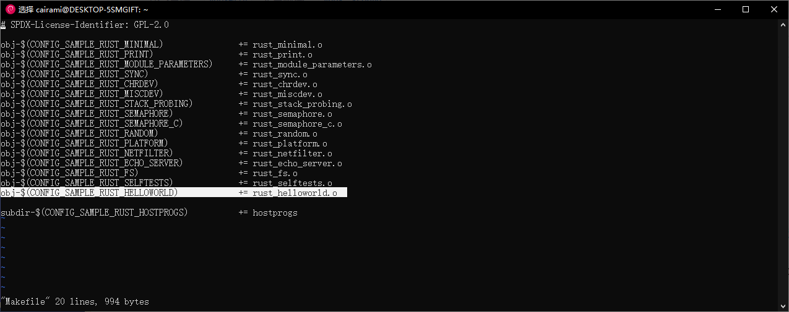

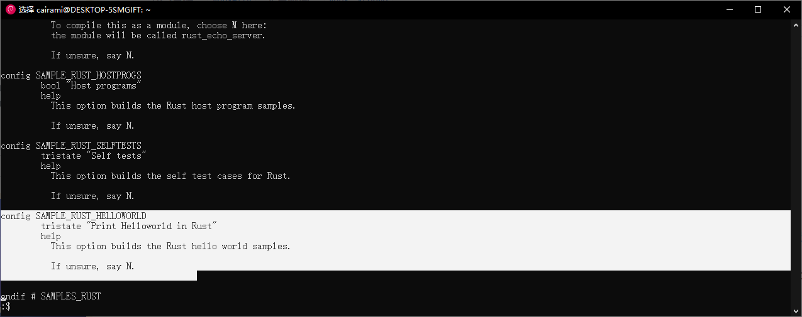

运行make LLVM=1 menuconfig，更改该模块的配置，使之编译成模块

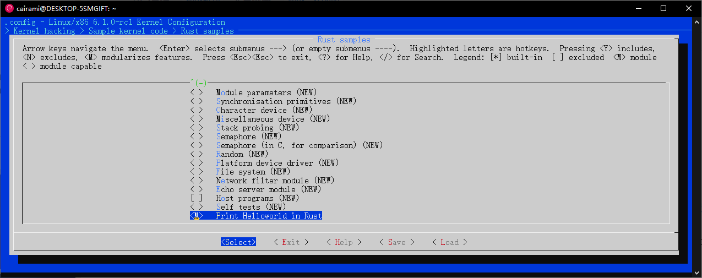

重新编译内核，生成rust_helloworld.ko，并复制到src_1000/rootfs目录下

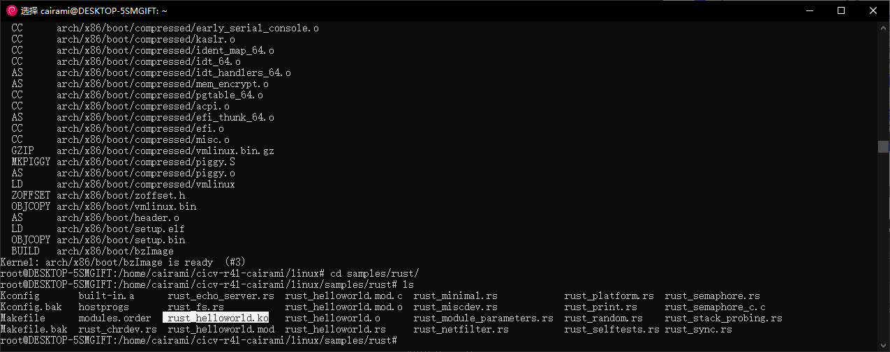

运行src_e1000/build_image.sh，在linux shell下insmod rust_helloworld.ko

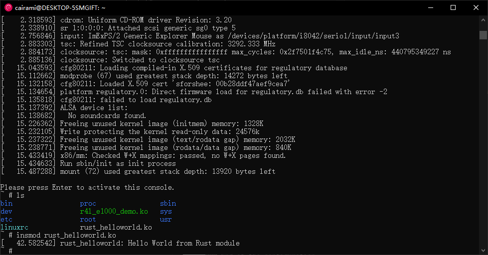

## 作业4：为e1000网卡驱动添加remove代码

### 在src_1000中运行./build_image.sh，进入qemu后，注册r4l_e1000_demo.ko

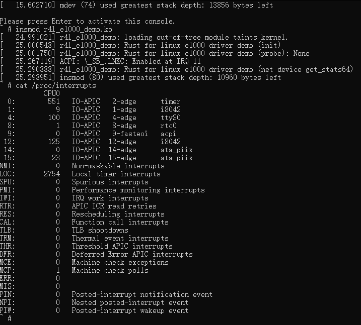

### up eth0，在/proc/interrupts中可以看到IRQ11对应到设备0000:00:03.0

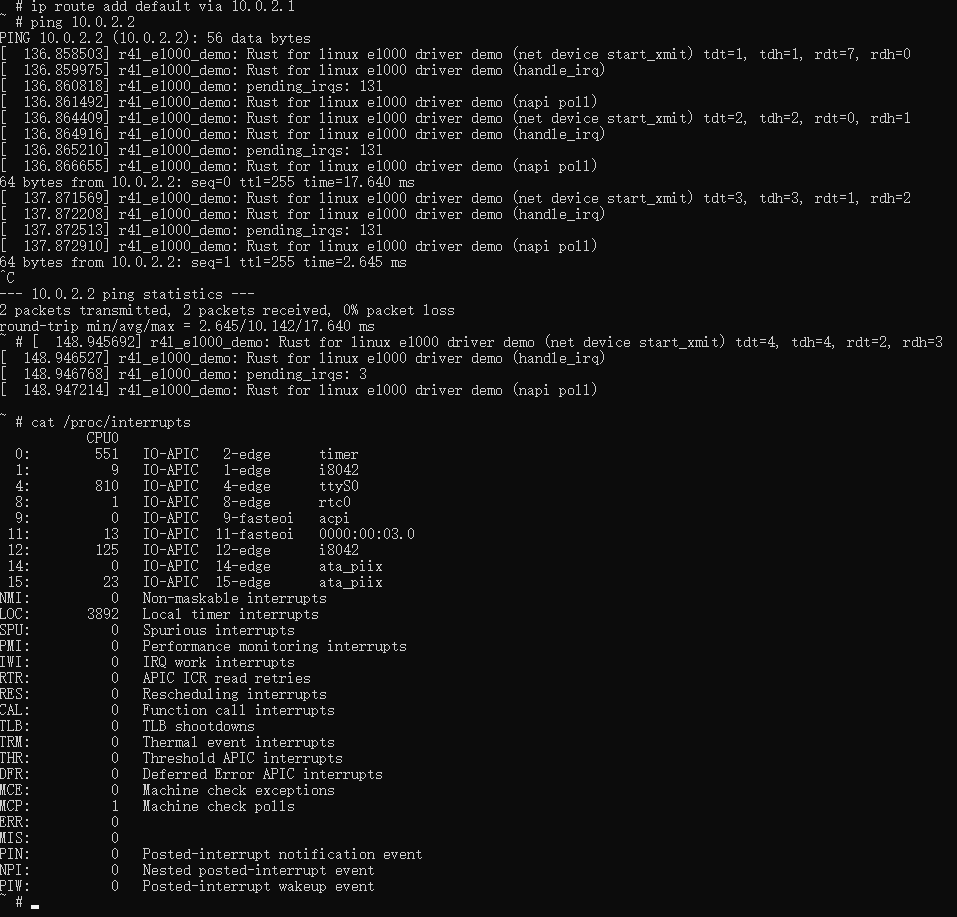

### down eth0，rmmod r4l_e1000_demo.ko，此时IRQ11没有对应的设备

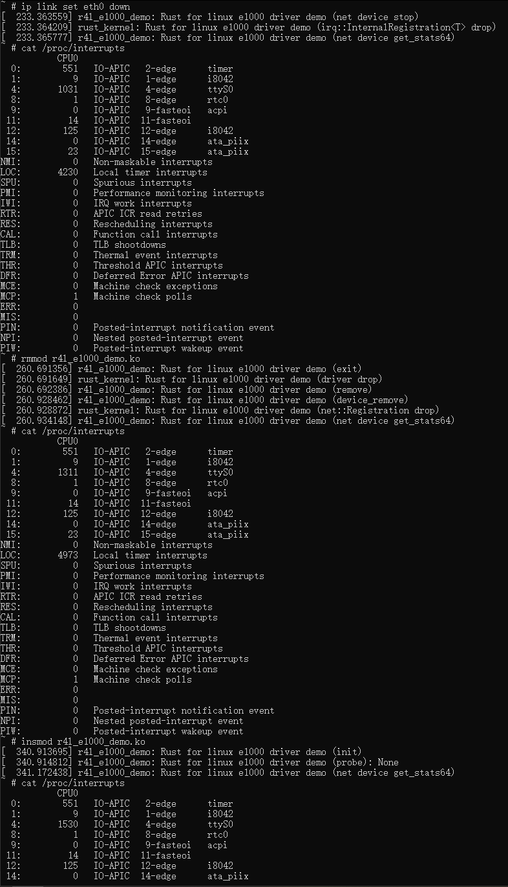

### 重新insmod r4l_e1000_demo.rs，并up eth0

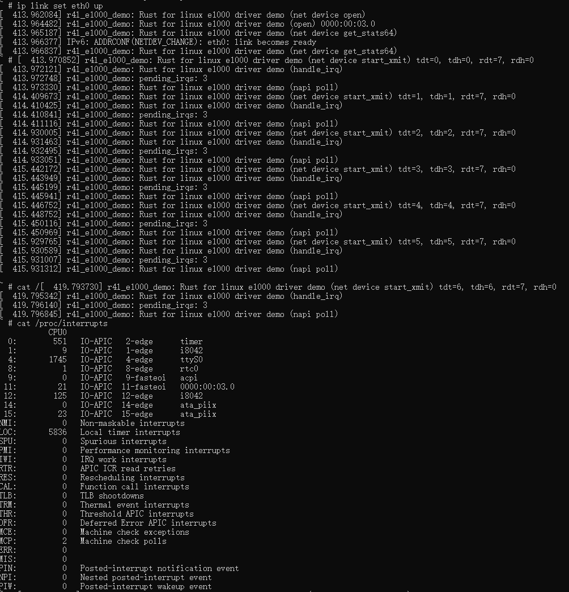

### 可以ping通10.0.2.2

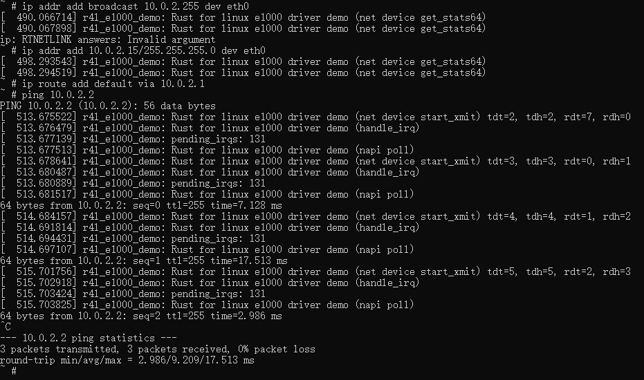

## 作业5：注册字符设备

### 更改配置

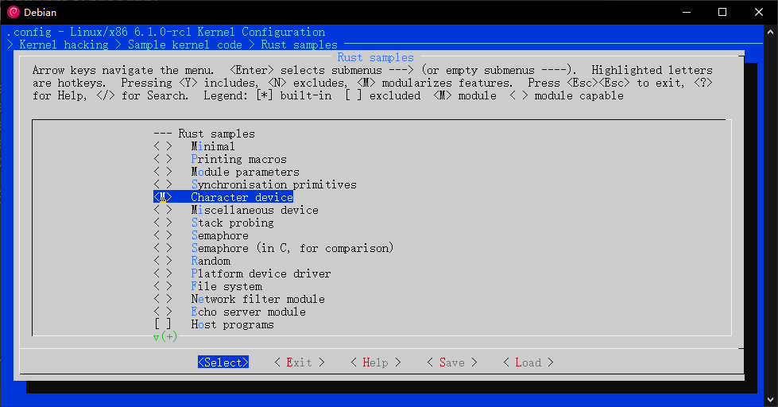

### 注册字符设备驱动，使/dev/cicv完成基本读写操作

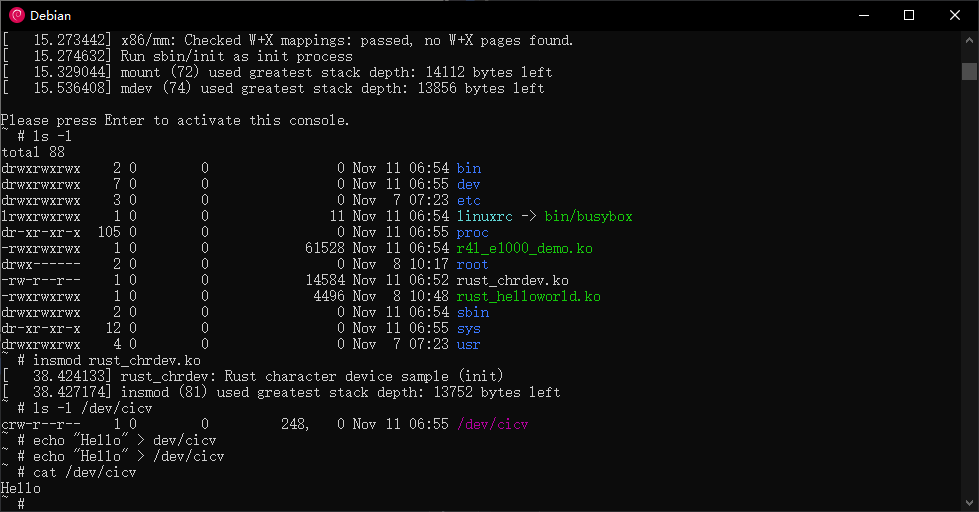

Q：作业5中的字符设备/dev/cicv是怎么创建的？它的设备号是多少？它是如何与我们写的字符设备驱动关联上的？

在src_e1000目录里的build_image.sh，
echo "mknod /dev/cicv c 248 0" >> etc/init.d/rcS

其中/etc/init.d/rcS是一个启动脚本，负责在系统引导过程中执行各种初始化任务。

使用mknod命令创建设备节点，用法如下：
mknod /dev/节点名称 c 主设备号 次设备号

因此/dev/cicv的主设备号是248，次设备号是0。

在注册这个字符设备驱动时，采用的是由系统动态分配设备号的方式，即alloc_chrdev_region。系统会查找/proc/devices中字符设备号从254到234中未分配的（从254开始找），而249到254已经被占用，所以该驱动分配到的设备号是248。这样就和/dev/cicv关联上了。
