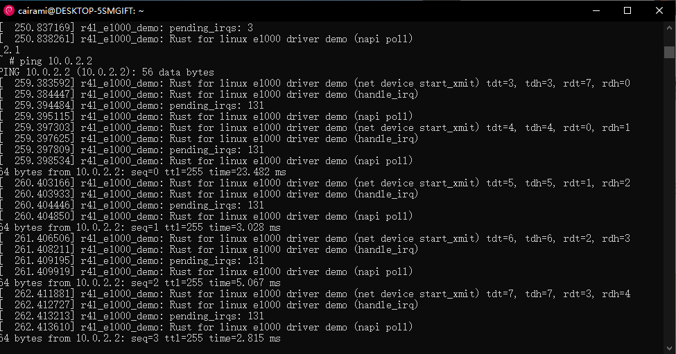

# 作业

## 实验环境搭建

### 配置BusyBox

生成_install目录

### 配置Linux文件夹
检查内核rust支持已经启用

## 作业1：编译Linux内核

### 进入Linux文件夹，使用如下命令进行编译：

#### make x86_64_defconfig

#### make LLVM=1 menuconfig

#set the following config to yes

#### make LLVM=1 -j$(nproc)

## 作业2：对Linux内核进行配置

### 编译src_e1000的代码成一个内核模块

### 禁用默认的C版本e1000网卡驱动

### 重新编译内核，运行./build_image.sh，启动Qemu

### 手动配置网卡驱动
insmod r4l_e1000_demo.ko
ip link set eth0 up
ip addr add broadcast 10.0.2.255 dev eth0
ip addr add 10.0.2.15/255.255.255.0 dev eth0 
ip route add default via 10.0.2.1

ping 10.0.2.2
